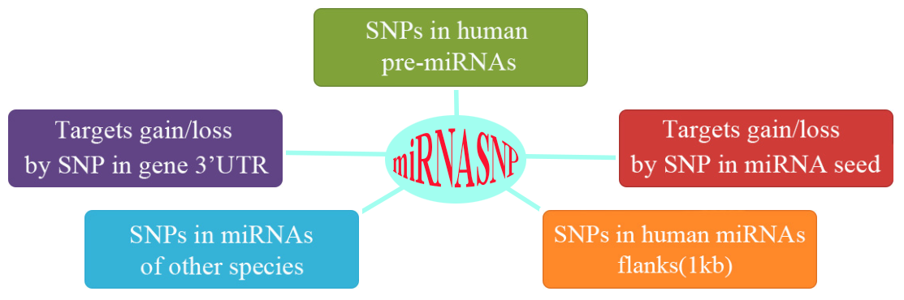

# miRNASNP2
>[An update of miRNASNP database for better SNP selection by GWAS data, miRNA expression and online tools.](http://www.ncbi.nlm.nih.gov/pubmed/?term=25877638)
Jing Gong, Chunjie Liu, Wei Liu, Yuliang Wu, Zhaowu Ma, Hu Chen, and An-Yuan Guo.    Database published online April 15, 2015, 2015: bav029

> [Genome-Wide Identification of SNPs in MicroRNA Genes and the SNP Effects on MicroRNA Target Binding and Biogenesis.](http://www.ncbi.nlm.nih.gov/pubmed/22045659)
J Gong, Y Tong, HM Zhang, K Wang, T Hu, G Shan, J Sun*, and AY Guo*.    Human Mutation 2011;DOI: 10.1002/humu.21641

# Introduction

MicroRNAs (miRNAs) are endogenous and regulatory non-coding RNAs by targeting mRNAs for cleavage or translational repression. SNPs in pre-miRNAs or target sites will affect miRNA function and be related with diseases or biological processes. miRNASNP aims to provide a resource of the miRNA-related SNPs, which includes SNPs in pre-miRNAs of human and other species, and target gain and loss by SNPs in miRNA seed regions or 3'UTR of target mRNAs.

# Databases

